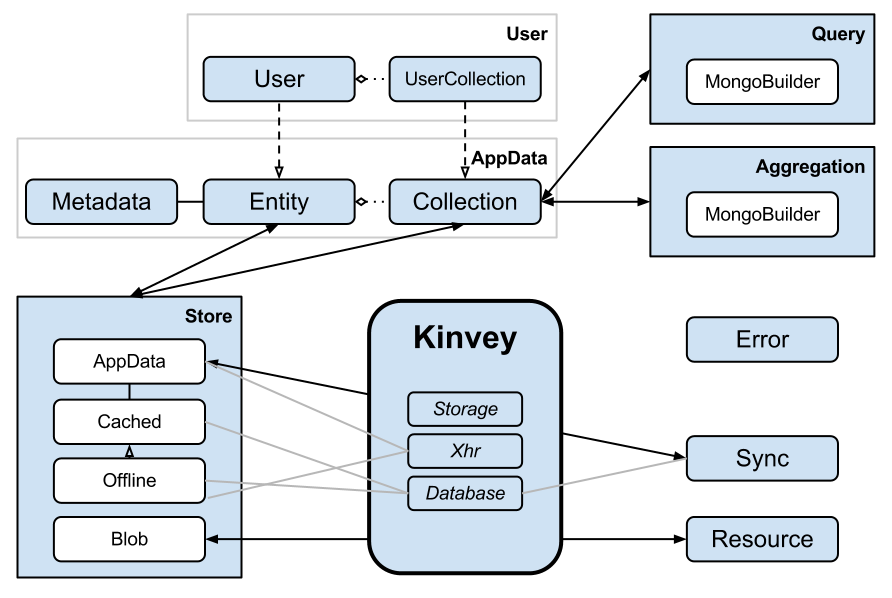

##Design and Architecture

The repository of the JavaScript Library is located [here](https://github.com/Kinvey/js-library-dev).

### Directory structure

The directory structure and contents of the repository is as follows:

```
│ dist/         # software artifacts generated by build
│ docs/
└── api/        # api documentation generated by build
│ lib/          # grunt plugins
│ src/          # library source
│ test/         # library unit tests
│ config.json   # library configuration
│ Gruntfile.js  # gruntfile
│ package.json  # repository configuration
```

### Architecture

All the source files are located inside the _src/_ folder. **Kinvey** holds the top-level namespace.

The **User** and **AppData** component are the core of the library. An **entity** always has a **metadata** object, to manage its ACL. Querying and aggregation is always done through a **collection**. MongoDB-specific syntax is abstracted away by the **Query** and **Aggregation** class, following the “Delegation Pattern”. **User** and **UserCollection** extend Entity and Collection respectively.

Requests against a data store are performed by entities and collections, through a store. Depending on the configuration passed to the entity or collection, an applicable store is returned by the **Store** factory. The store is one of:

*   **AppData**: performs requests against Kinvey’s remote service.
*   **Cached**: uses AppData and a local **database** to implement caching,
*   **Offline**: extends Cached by allowing write operations against the local database,
*   **Blob**: implements the Resource API, exclusively used by the **Resource** component.

The **Sync** component synchronizes data in the local database with Kinvey, through an AppData store instance. The **Error** component is globally used by all components to unify error messages. The **Storage** component is used by the top-level namespace to (re)store the current user. The **XHR** component is used for building HTTP requests, including the generation of anonymous users, and proper authorization.

The high-level architecture described above is depicted below.



### Builds
Four builds of the JavaScript Library are defined:

*   HTML5
*   Node.js
*   PhoneGap
*   Titanium

All share a common codebase. Per platform slight modifications to this common codebase are made. These modifications can be recognized by filenames like _Xhr.titanium.js_. Here, the platform-specific file is preferred over the shared one, _Xhr.js_.

Some builds may include functionality others don’t provide. For example, support for the Resource API is only available in Node.js, PhoneGap, and Titanium. What components are included in what build is determined in the _gruntfile_. See [Development procedures](development-procedures.md).
